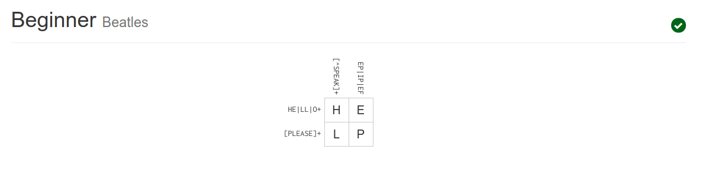

## Other Tips for Answering Questions
- If you don't know the specifics but have an idea of how to solve the problem given certain information, maybe ask questions to help gather that information from the community
- If you know somebody is more qualified to answer the question, mention them in the post to notify them

## Response to Free Culture
This case of Jesse's fight against the RIAA is just one of many examples of shameless lawsuits in the name of copyrights. The RIAA clearly had no intention of winning the lawsuit, they just wanted to bully the defendants into giving up whatever money they could. There should be statutes put into place at this point protecting providers of a service from possible infractions made by the clients. Otherwise, Google would be facing countless lawsuits on a near daily basis since it provides easy access to pirated materials. If these protections existed at the time, this incident showcases the importance of including a license/terms of use with the program. Such a document could have offloaded the responsibility of pirated information onto the original uploader instead of the service provider.

## Tree

## Regexs
##### Q1

##### Q2

## Maze

## Reflection

One of the most interesting projects in the open source world is Microsoft's dotnet repo.
It represents a remarkable shift from the company's long established policy of only having premium software to open-sourcing their largest developer platform. Since .NET itself previously existed as proprietary software (some parts still are), I'm curious how much of the platform was retroactively open-sourced or was written from scratch. Also back when .NET core was the only flavor around (.NET Framework but closed source and with some extra Windows features), Microsoft had a very tricky license. The platform itself was free to use in any way; however, any software developed using it had to use the platform, or else Microsoft could claim patent rights. While this still qualifies as free software, it goes againt a core principle of open source: "The license must not place restrictions on other software that is distributed along with the licensed software." Nowadays, Microsoft has pivoted and has begun using the MIT license instead, a staple of the open source community
