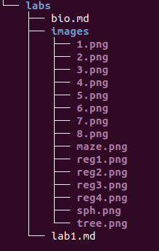

## Other Tips for Answering Questions
- If you don't know the specifics but have an idea of how to solve the problem given certain information, maybe ask questions to help gather that information from the community
- If you know somebody is more qualified to answer the question, mention them in the post to notify them

## Response to Free Culture
This case of Jesse's fight against the RIAA is just one of many examples of shameless lawsuits in the name of copyrights. The RIAA clearly had no intention of winning the lawsuit, they just wanted to bully the defendants into giving up whatever money they could. There should be statutes put into place at this point protecting providers of a service from possible infractions made by the clients. Otherwise, Google would be facing lawsuits on a near daily basis since it provides easy access to pirated materials.

## Tree

## Regexs
##### Q1

##### Q2

## Maze

## Reflection

One of the most interesting projects in the open source world is Microsoft's dotnet repo.
It represents a remarkable shift from the company's long established policy of proprietary,
premium software into the realm of free and open.
