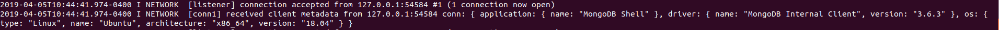
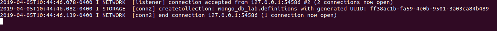
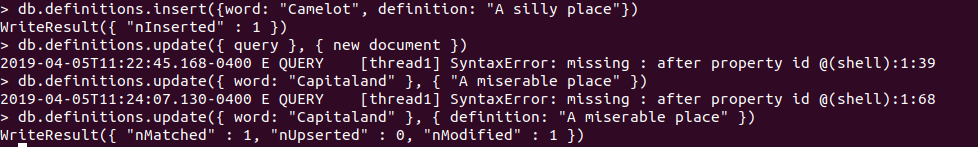
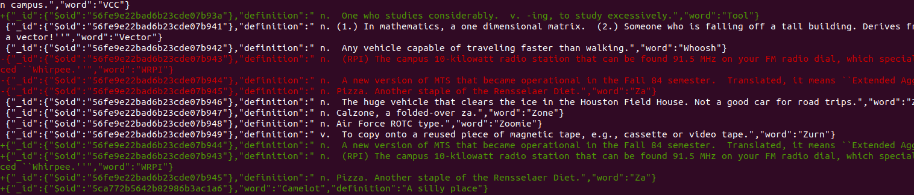

# Lab 10 - Databases

## Checkpoint 1:

## Checkpoint 2:

## Checkpoint 3:
- *find()*: Finds all the entries in the db
- *findOne()* : Returns the first entry in the db
- *find({word: "Capitaland"})* : Finds entry where the word key is "Capitaland"
- *find({_id: ObjectId("56fe9e22bad6b23cde07b8ce")})* : Finds the entry with that id

## Checkpoint 4:

## Checkpoint 5:
