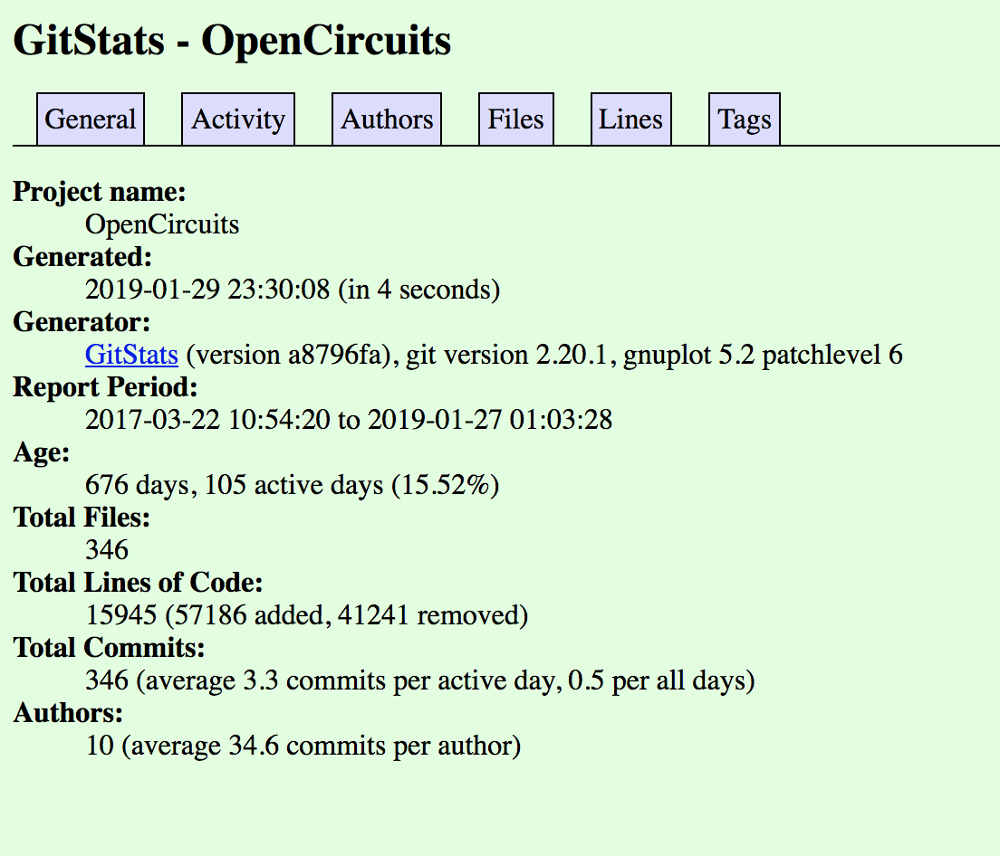
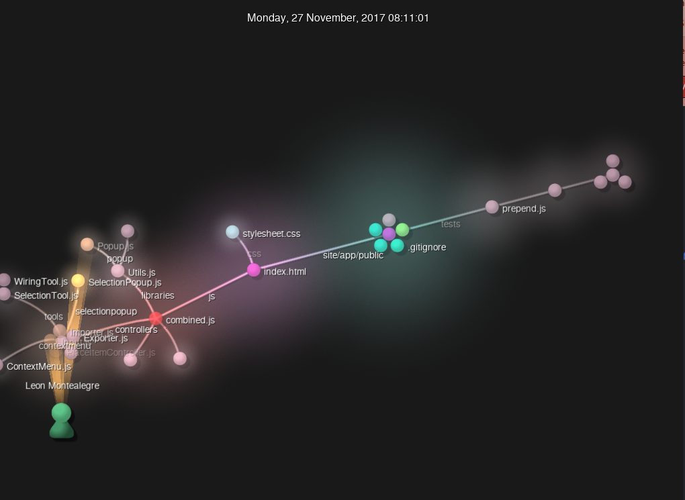
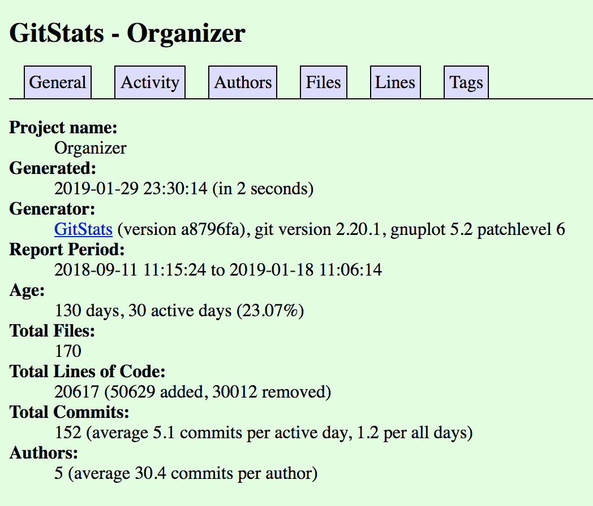
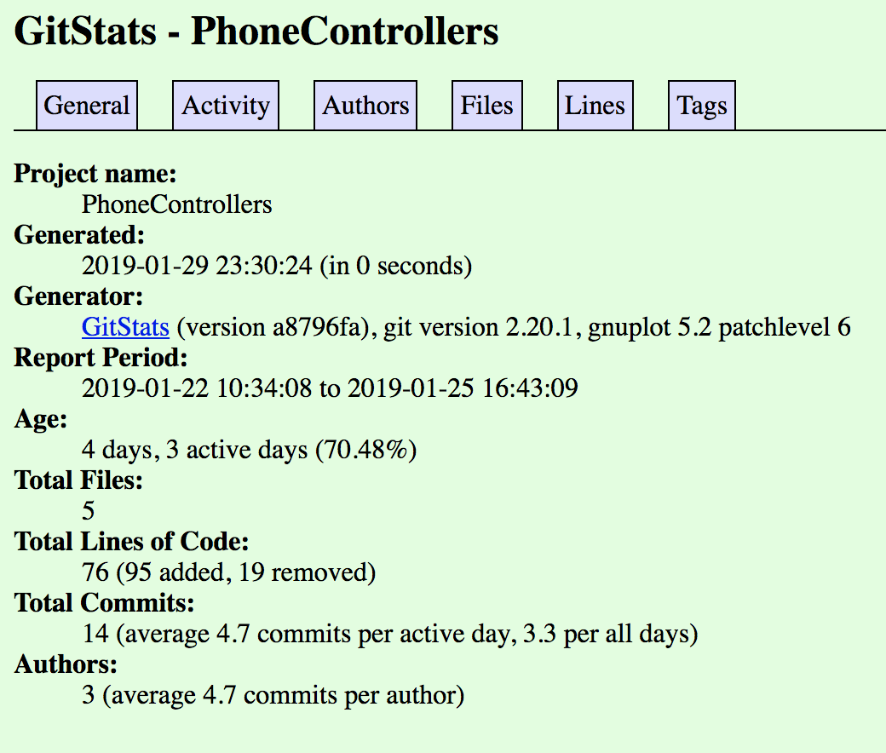
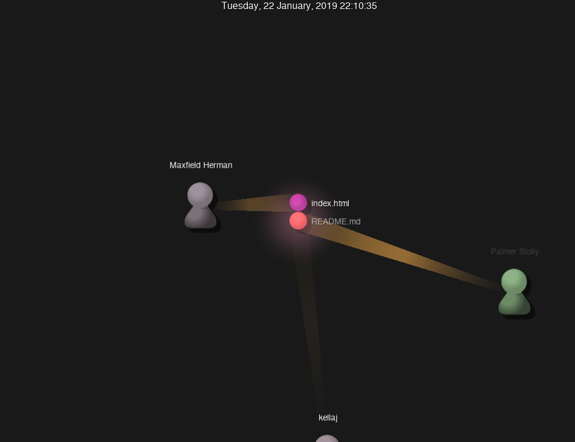
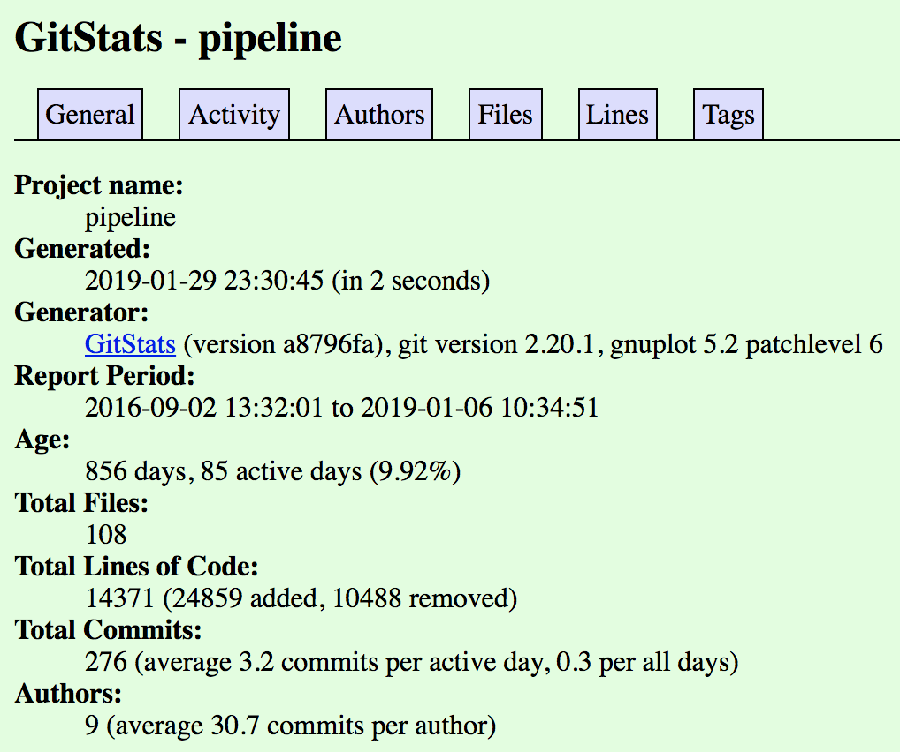
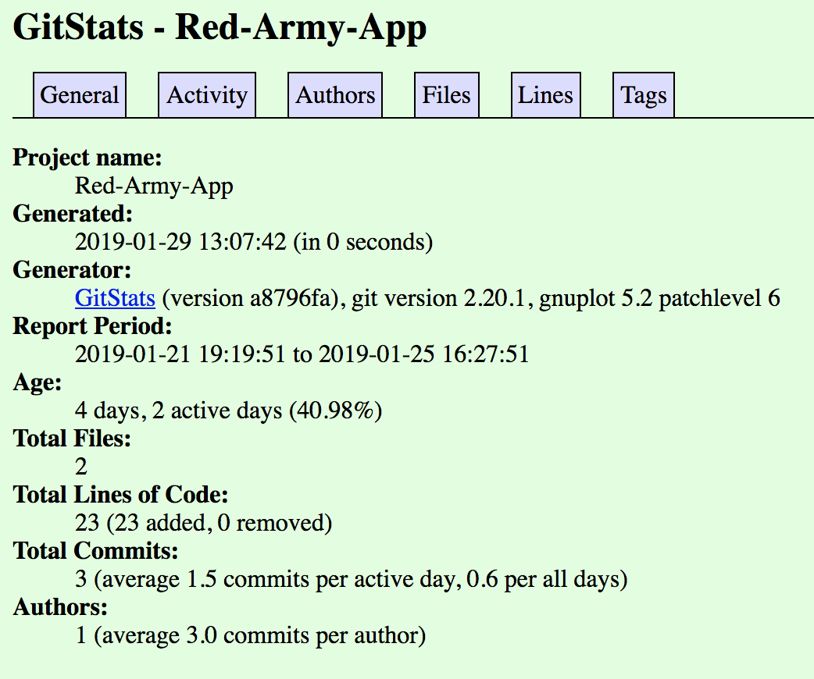
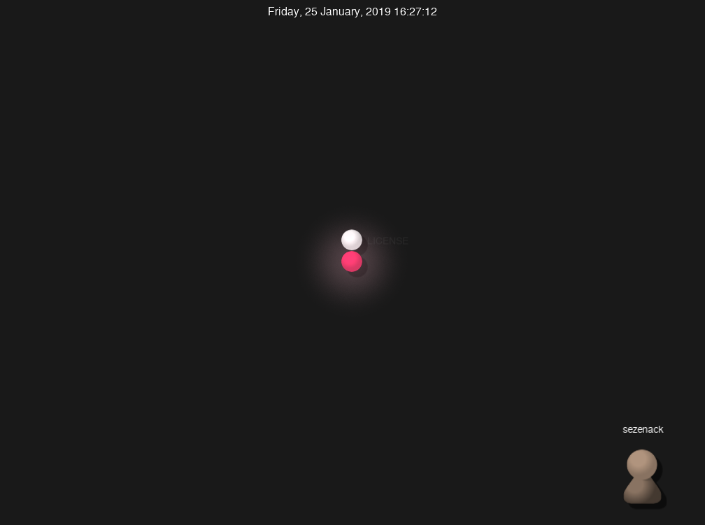
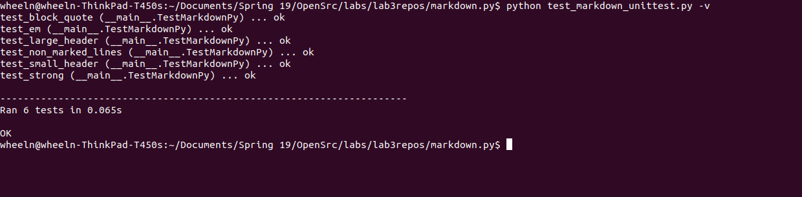

## Part 1

### Open Circuits
Contributors: 8  
Lines of Code: 16161  
First Commit: 3/22/2017  
Last Commit: 1/27/2019  
Branches: 5
Leader: LeonMontealegre

### Organizer
Contributors: 4
Lines of Code: 42759  
First Commit: 9/11/2018  
Latest Commit: 1/18/2019  
Branches: 2  
Leader: NeverBehave

https://www.youtube.com/watch?v=RNQ1Mi7HG5M&feature=youtu.be

### PhoneControllers
Contributors: 3  
Lines of Code: 74  
First Commit: 1/22/2019   
Last Commit: 1/25/2019  
Branches: 1  
Leader: Too early to tell

### Pipeline
Contributors: 7  
Lines of Code: 14965  
First Commit: 9/2/2016  
Latest Commit: 1/6/2019  
Branches: 1  
Leader: kochman

https://www.youtube.com/watch?v=_rcXZxHJkRo&feature=youtu.be

### Red Army App
Contributors: 1  
Lines of Code:  23
First Commit: 1/21/2019  
Latest Commit: 1/25/2019  
Branches: 1  
Leader: sezenack

## Part 2

