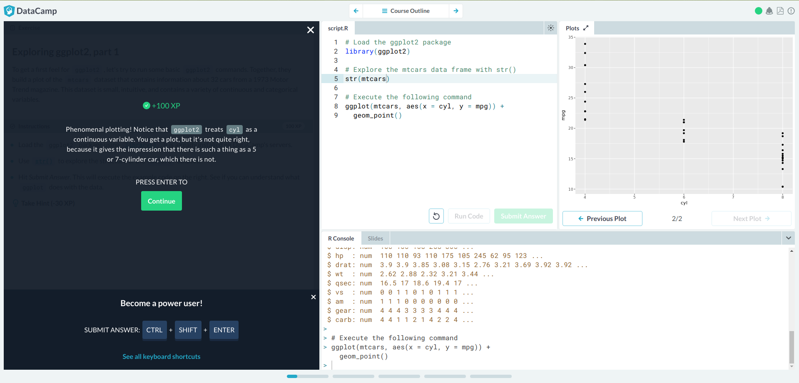
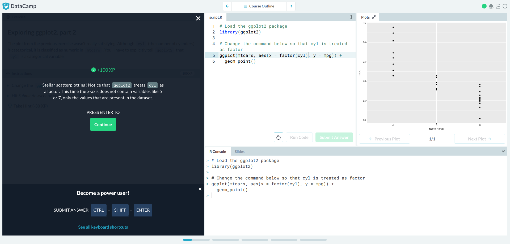
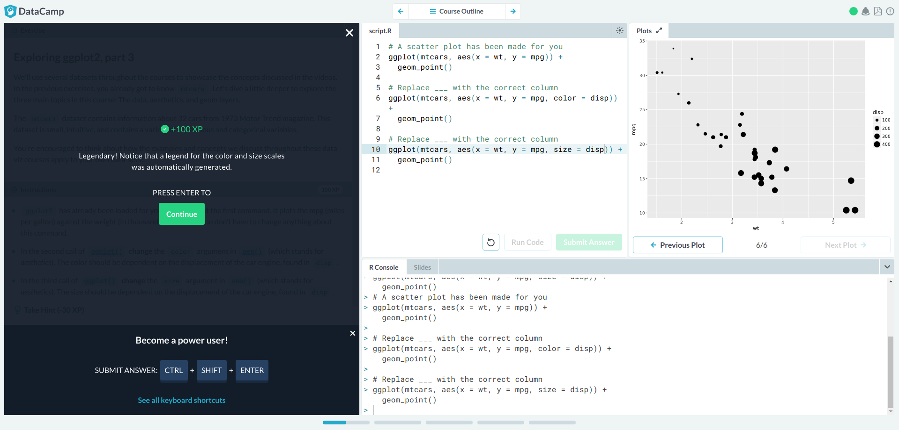
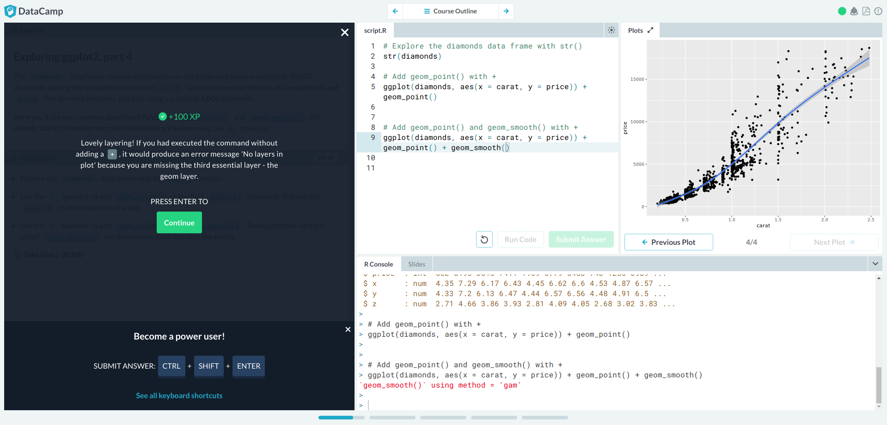
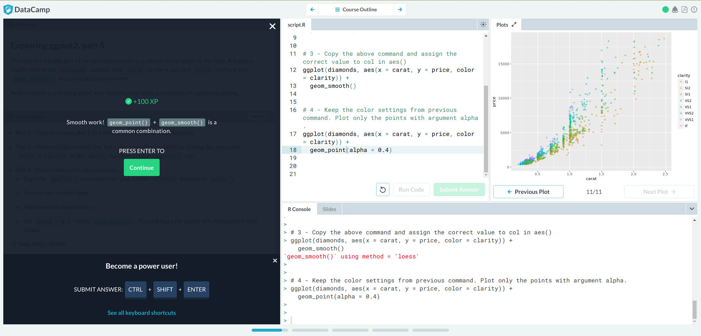
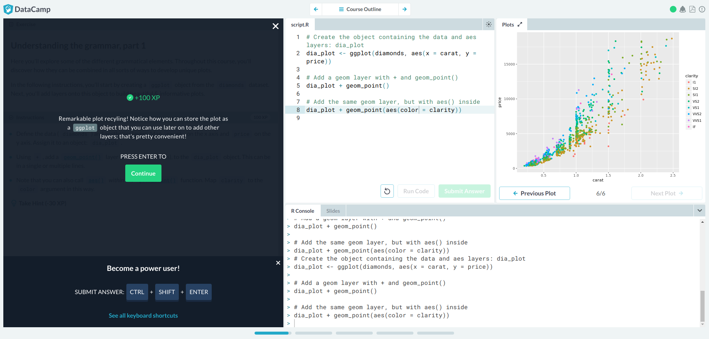
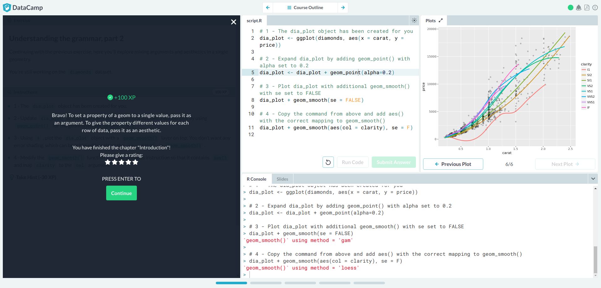
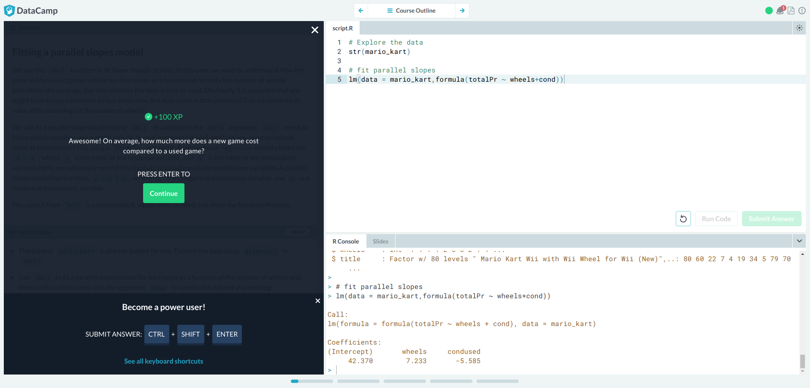
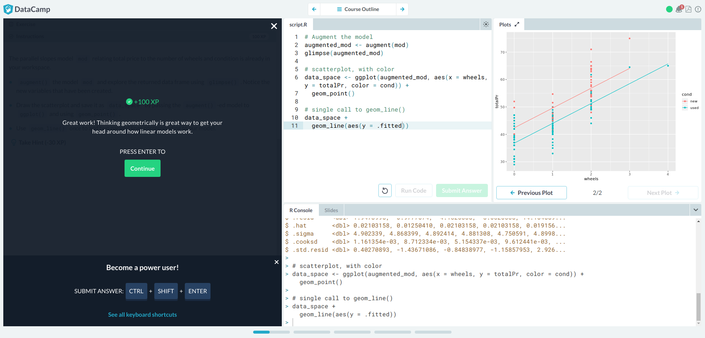
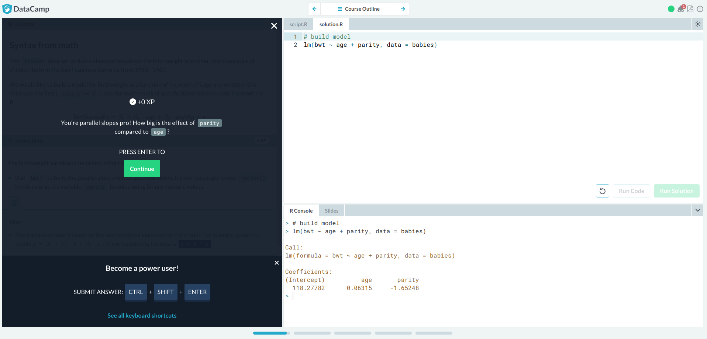

# Lab 7

## ggplot2 Chapter 1

## Multiple and Logistic Regression

~[q4](lab7Images/Screenshot from 2019-03-15 13-05-48.png)

## [Link to RCOS project](https://rcos.io/projects/tlouison/storyhop/profile)
